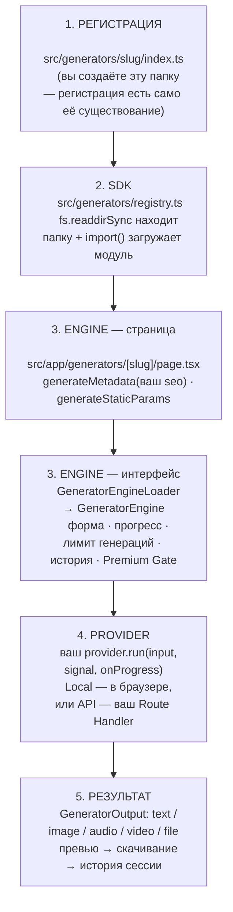

# Generator SDK — руководство для разработчиков

Инструкция для тех, кто добавляет новый генератор в проект. Если нужно
быстро добавить генератор — сразу переходите к разделу
[«Создать генератор за 5–10 минут»](#создать-генератор-за-510-минут).
Если хочется сначала понять, как всё устроено — начните со
«Жизненного цикла» ниже.

## Официальный референс архитектуры

**Копируйте `src/generators/pattern/index.ts`.** Это эталонная реализация
(Этап 7) — единственный генератор, который стоит использовать как шаблон.
Он специально выбран максимально простым: без Canvas, без Web Audio, без
загрузки файлов — просто вход → строка SVG → выход. Всё остальное в этом
README объясняется на его примере.

Остальные генераторы (`svg`, `qr`, `mockup`, `audio`) — рабочие,
проверенные примеры доп. возможностей (Canvas, Web Audio, файлы, API
Provider), но не шаблон для копирования.

## Жизненный цикл генератора



1. **Регистрация** — вы создаёте `src/generators/<slug>/index.ts`.
   Отдельного шага «зарегистрировать» не существует: само существование
   папки и есть регистрация.
2. **SDK** (`src/generators/registry.ts`) — при следующей сборке или
   перезапуске `next dev` серверный код находит папку через
   `fs.readdirSync` и подгружает `index.ts` через `import()`, проверяя,
   что `generator.slug` совпадает с именем папки.
3. **Engine** — `src/app/generators/[slug]/page.tsx` (один файл на ВСЕ
   генераторы) берёт ваш модуль из SDK: серверная часть отдаёт
   `generateMetadata` ваш `seo` и статически пре-рендерит страницу через
   `generateStaticParams`, а интерактивную часть передаёт клиентскому
   `GeneratorEngineLoader` → `GeneratorEngine`, который сам рендерит
   форму по вашим `fields`, следит за прогрессом, дневным лимитом
   бесплатных генераций, Premium Gate (Этап 4) и историей сессии.
4. **Provider** — когда пользователь нажимает «Сгенерировать», Engine
   вызывает ВАШУ функцию `provider.run({ input, signal, onProgress })`.
   Это единственное место во всей системе, где есть логика конкретно
   вашего генератора.
5. **Результат** — то, что вернул `run()` (`GeneratorOutput`), Engine сам
   показывает в превью, предлагает скачать и добавляет в историю сессии.

## Создать генератор за 5–10 минут

1. Скопируйте `src/generators/pattern/` → `src/generators/<ваш-slug>/`.
2. Поменяйте `slug` на имя новой папки — единственное поле, которое
   **обязано** совпадать с именем папки, и первое, что стоит поменять.
3. Поменяйте `title`, `description`, `icon` (любая иконка из
   `lucide-react`), `categoryId` (должен существовать в
   `src/config/categories.ts`).
4. Замените массив `fields` на свою форму (справочник типов — ниже).
5. Замените тело `provider` на свою логику генерации — Local или API
   (см. ниже). Результат должен быть одним из `GeneratorOutput`.
6. Замените `seo.title` / `seo.description` / `seo.keywords`.
7. `npm run dev`, откройте `/generators/<ваш-slug>` — готово.

Итого: один файл, ни одной новой страницы, ни одной правки в Engine/SDK.

## Файлы, которые нужно создать

- **`src/generators/<slug>/index.ts`** — обязательно, единственный файл
  для Local Provider.
- **`src/app/api/generators/<slug>/route.ts`** — дополнительно, только
  если генератор использует API Provider и нужен собственный backend
  (пример: `src/generators/qr` + `src/app/api/generators/qr/route.ts`).
- **`src/generators/<slug>/<slug>-worker.ts`** — дополнительно, только
  для тяжёлого Local Provider через Web Worker (Этап 11, см. раздел
  ниже; пример: `src/generators/mockup/mockup-worker.ts`).

Больше ничего создавать не нужно.

## Файлы, которые никогда не нужно менять

Если ради нового генератора приходится редактировать что-то из списка
ниже — что-то пошло не так, вернитесь к шагам выше.

- `src/app/generators/[slug]/page.tsx` — универсальная страница генератора
- `src/app/generators/page.tsx` — каталог
- `src/generators/registry.ts` — автообнаружение (SDK)
- `src/generators/types.ts` — контракт `GeneratorModule`
- `src/lib/generator-engine/*` — весь Generator Engine (Этап 5)
- `src/components/generator-engine/*` — весь UI движка
- `src/components/layout/*` — Sidebar/Header/Footer/Container (Layout, Этап 3)
- `src/components/subscription/*` — Premium Gate (Этап 4)

## Справочник: типы полей формы

| `type` | Значение | `defaultValue` |
|---|---|---|
| `text` | однострочный текст | `string` |
| `textarea` | многострочный текст | `string` |
| `select` | выпадающий список (`options`) | `string` |
| `slider` | число в диапазоне (`min`/`max`/`step`) | `number` |
| `switch` | переключатель вкл/выкл | `boolean` |
| `color` | выбор цвета | `string` (hex) |
| `file` | загрузка файла (`accept`) | — |

Полные определения — `src/lib/generator-engine/types.ts` (`GeneratorFieldSchema`).

## Справочник: типы результата (`GeneratorOutput`)

| `kind` | Поля | Когда использовать |
|---|---|---|
| `text` | `content` | сгенерированный текст |
| `image` | `url`, `mimeType?` | картинка/SVG (`data:`, `blob:` или обычный URL) |
| `audio` | `url`, `mimeType?` | звук |
| `video` | `url`, `mimeType?` | видео |
| `file` | `url`, `filename`, `mimeType?` | произвольный файл для скачивания |

## Local Provider vs API Provider

**Local** (`createLocalProvider`) — вся генерация в браузере, без сети.
Подходит для SVG/Canvas-трансформаций, Web Audio, чистых JS-вычислений.
Примеры: `pattern`, `svg`, `audio`. (`mockup` тоже Local, но выполняется
в Web Worker — см. раздел ниже.)

```ts
provider: createLocalProvider(async ({ input, onProgress }) => {
  onProgress({ message: "..." });
  // ваша логика
  return { kind: "text", content: "..." };
}),
```

**API** (`createApiProvider`) — запрос на СОБСТВЕННЫЙ Route Handler
проекта, а не на вендора напрямую (ключи остаются на сервере). Внутри
эндпоинта может быть что угодно — OpenAI, Anthropic Claude, Google
Gemini, FLUX, ElevenLabs, npm-библиотека — Generator Engine об этом не
знает и не должен знать. Пример: `qr` → `/api/generators/qr`.

```ts
provider: createApiProvider({
  endpoint: "/api/generators/<slug>",
  parseResponse: (data) => ({ kind: "image", url: data.url }),
}),
```

## Local Provider в Web Worker (Этап 11) — только для тяжёлых генераторов

Обычный `createLocalProvider` выполняет `run()` на основном потоке —
для 95% генераторов (SVG-строка, JSON, текстовые трансформации) это
правильный выбор: создание воркера и передача данных не бесплатны, а
сама генерация занимает миллисекунды. Переходите на воркер, только
если вычисление реально заметно на глаз (Canvas-композитинг больших
изображений, тяжёлый DSP, парсинг больших файлов) — пример: `mockup`
(`src/generators/mockup/`).

Три файла вместо одного:

- **`index.ts`** — как обычно, но провайдер собирается через
  `createWorkerLocalProvider` (`@/lib/generator-engine/api-provider`)
  вместо `createLocalProvider`.
- **`<slug>-worker.ts`** — сам воркер. Внутри нет `window`/`document`:
  вместо `new Image()` используйте `createImageBitmap`, вместо
  `<canvas>` — `new OffscreenCanvas(...)`. Отвечает главному потоку
  сообщениями формата `WorkerResponse` из
  `@/lib/generator-engine/worker-protocol`.
- **общий модуль чистых функций** (например `draw.ts`) — если логика
  отрисовки/вычисления не зависит от DOM, вынесите её в отдельный файл
  и импортируйте и из воркера, и из `fallback` в `index.ts`, чтобы не
  дублировать код и не давать им незаметно разойтись.

```ts
// index.ts
provider: createWorkerLocalProvider({
  createWorker: () => new Worker(new URL("./<slug>-worker.ts", import.meta.url)),
  buildMessage: (input) => ({ /* то, что нужно воркеру */ }),
  parseResult: (result) => ({ kind: "image", url: result.url }),
  // ОБЯЗАТЕЛЕН: основной поток — для браузеров без Worker/OffscreenCanvas.
  fallback: async ({ input }) => { /* тот же алгоритм, DOM-версии API */ },
}),
```

`fallback` — не заглушка «на всякий случай», а полноценный второй путь:
`createWorkerLocalProvider` сам проверяет доступность `Worker` и падает
на `fallback`, если конструктор воркера бросил исключение. Без честного
fallback генератор просто перестанет работать в части браузеров.

## Чек-лист перед тем, как считать генератор готовым

- [ ] `slug` совпадает с именем папки
- [ ] `npx tsc --noEmit` и `npx eslint .` — без ошибок
- [ ] `npm run build` — генератор появился в списке маршрутов сборки
- [ ] Реально сгенерировали результат (не только открыли форму)
- [ ] Скачивание результата работает
- [ ] `categoryId` существует в `src/config/categories.ts`
